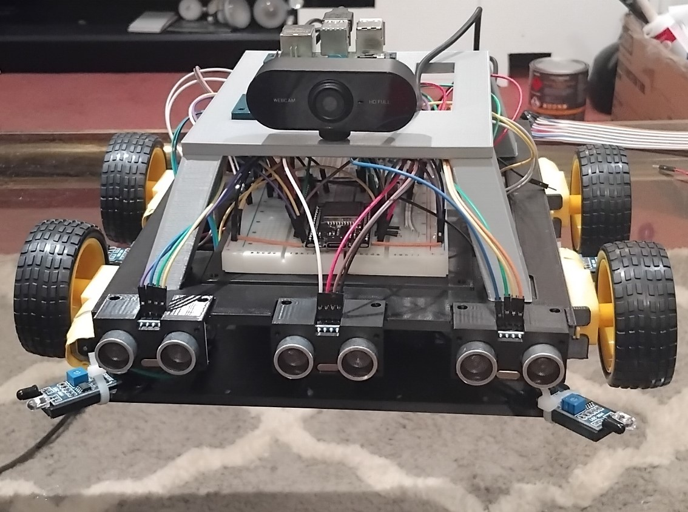

# Robot_Project (Iteration One)

Of this commit the robot has gone through its first full iteration of design
Next Step is to create the first iteration of Software mainly focussing on Connecting 
the low and high level controllers via a UART physical connection and ensure all motors 
and sensors function correctly and send data up the layers.

After These Steps have successfully been done the next step will be to begin automatic driving and object detection and object awareness
of the robot.

## Check List

- ~~Complete First Iteration of robot design and Construction~~
- Get Low and High level systems communication via physical UART.
- Get High-Level Rasp pi communicating with Laptop (Will as user Interface with Robot).
- Get all motors and sensors successfully communicating and working with ESP32 Low-Level Controllers and allow for commands to be sent to hardware.
- Get Rasp Pi sensor information via ESP32 and camera and allow Rasp Pi to issue commands to hardware via ESP32 (UART connection).
- Allow user via Laptop interface to control motors on robot allowing user to move the robot.
- Begin iteration two of software designing automatic driving and object detection and object awareness.

## Hardware List

- Rasp Pi 4 (High-level Control over Robot)
- ESP32 Development Kit (Low-Level Control over Robot, handles Control over Sensors and Motors)
- Four (Model Spec needed) IR Sensors (For wall and side object detection)
- Four (Model Spec needed) UltraSound Sensors (For forwards and rear Object distance detection)
- (Need spec on bread board)
- Four 1K Ohm and 2K Ohm Resistors (For Voltage Divider for Logic signal voltage from US sensor to ESP32 controller to step down from 5V to 3.3V)
- Four (Model Spec needed) Motors and Wheels
- (Model spec needed) Webcam (For Object Detection and enabling visible Light View for Robot)
- LM2587 DC-DC converter (As power supply is 9V and I need max 5V this is required to step down voltage)

#### All iterations of the robots design for the foreseeable future will be printed from PLA and plastic made from substances like CornStarch making them more eco friendly and less harmful especially since each iteration will take many trials on parts adding up in the amount of plastic used.
## First Iteration of Robot Design Process (Complete)
### Final Version of Robot in this iteration

#### All parts that built the robot are available in the 3d folder and later will be in a directory inside this called FirstIteration
The Process of making this robot has taken about 2 months including waiting times for 
parts to arrive and the design process to create them.

By no means is this design great however, this has enabled me to learn about CAD
design and how to use the software well, as well as how to use a 3D Printer and its software

The Next iterative design will take place after Iteration two of Software

The overall goal of my first design was to make it modular
each sensor as a unique part connecting it to the robot main chassis
with holes for bolts to bind them to the body.
You will notice however there are no bolts on the design as I had to wait awhile for them to arrive
as there were not available in Wellington and only in Auckland due to their small size.
I ended up resorting to using superglue. This means i am going to have to re print each part, but the
hardware will still be functional as there are bound by zip ties or small amount of superglue and they 
are easy to pry off.

## Step Two: Get Low and High level systems communication via physical UART (Ongoing)

#### Due to assignments i have only just begun this however i have done trials on connections before.
### Code Stack

For all back-end operations i will be using Rust including all network areas

